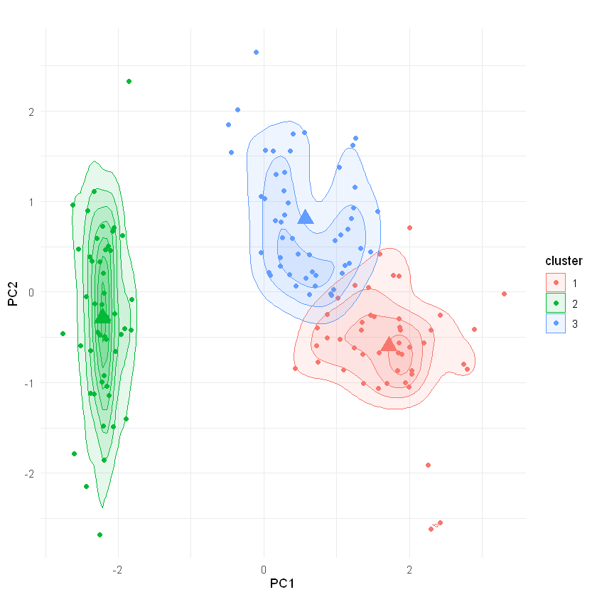
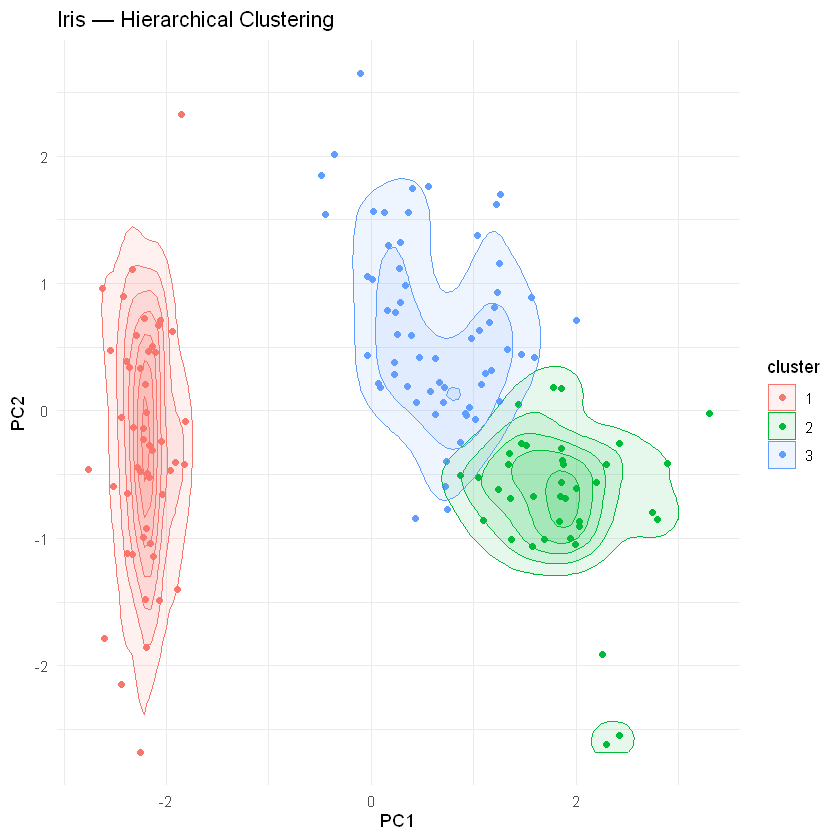
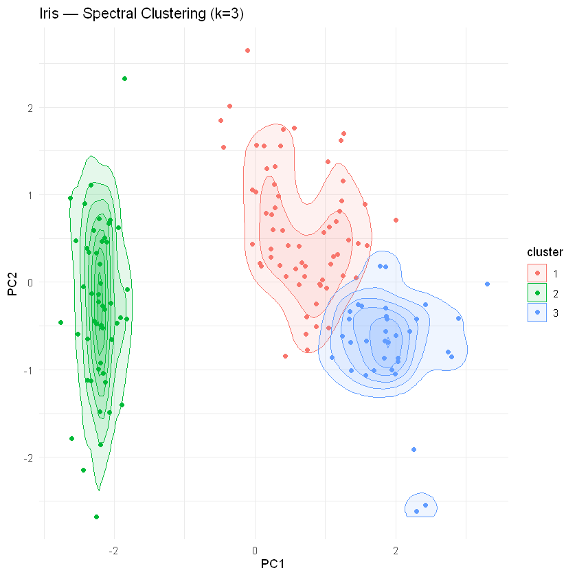
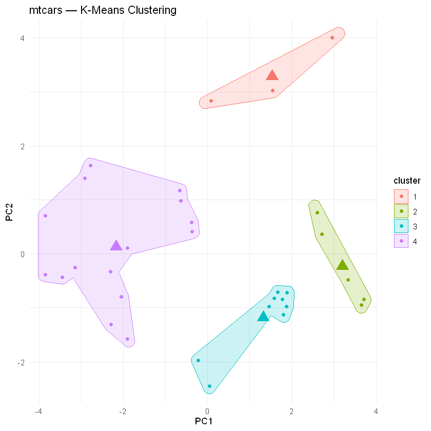
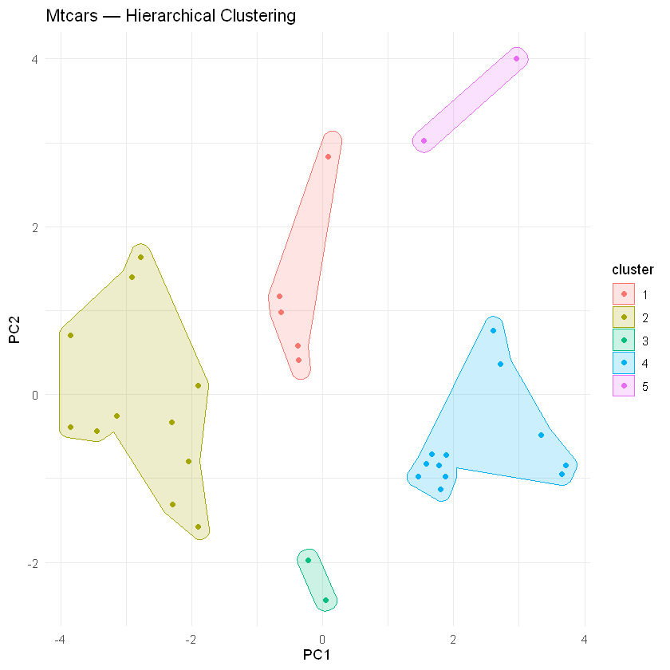
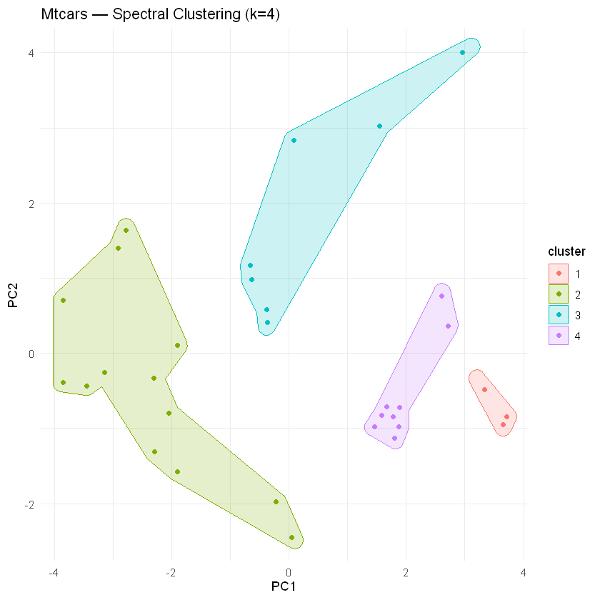
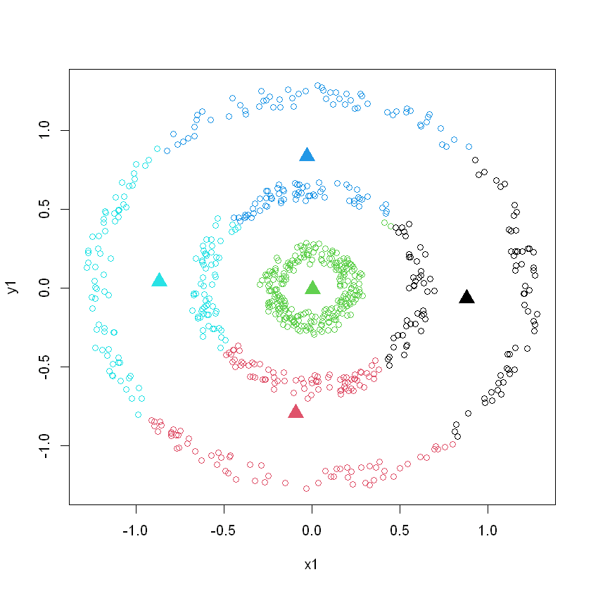
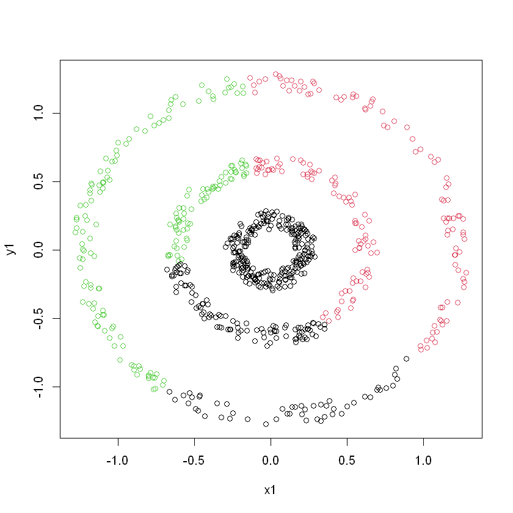
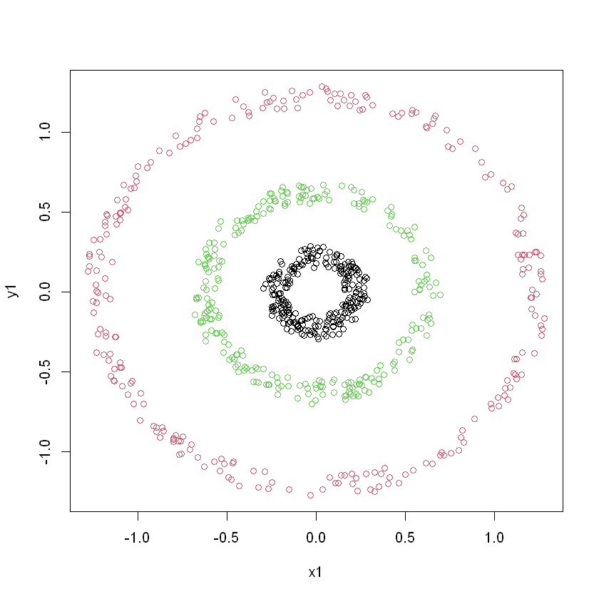

# Comparison of Clustering Methods in R

This project performs a comparative analysis of three clustering algorithms - **K-Means**, **Hierarchical**, and **Spectral** clustering across datasets with varying structural characteristics. The goal is to evaluate how different algorithms handle convexity and nonlinearity in data and varying feature magnitudes.

## Requirements

- **R** >= 4.2.0
- **Python** >= 3.12.4
- **JupyterLab** >= 4.5.3
- **IRkernel**
    To install, run the following in R console:
    ```r
    install.packages("IRkernel")
    IRkernel::installspec(user = TRUE)
    ```

## Overview of the Experiment

| Dataset | Source | Characteristics |
|:---|:---|:---|
| **`iris`** | [Built-in R dataset](https://stat.ethz.ch/R-manual/R-devel/library/datasets/html/iris.html) | 3 types of iris flowers, convex clusters, versicolor and virginica classes linearly inseparable, 150 observations, 4 numeric features, 3 balanced target classes. |
| **`mtcars`** | [Built-in R dataset](https://stat.ethz.ch/R-manual/R-devel/library/datasets/html/mtcars.html) | 32 different cars with their paremeters. 32 observations, 9 numeric features (mix of continuous and discrete), 2 categorical. Values of different magnitudes. No predefined target classes. |
| **`circles3`** | [clusterSim package](https://cran.r-project.org/web/packages/clusterSim/clusterSim.pdf#Rfn.shapes.circles3.1) | 250 synthetic points for each out of 3 2D concentric circles, non-convex clusters, linearly inseperable, connectivity based clusters. Each circle is a target class |

## 🛠 Methodology

The project workflow is structured as follows:

1.  **Environment Preparation**: Loading necessary R libraries
2.  **Exploratory Data Analysis (EDA)**:
    * Inspection of data types, value ranges, and missing values
    * Correlation analysis.
    * **PCA (Principal Component Analysis)**: Reducing dimensions to visualize the "ground truth" structure of the data in 2D space.
3.  **Data Preprocessing**:
    * Feature selection.
    * **Z-score Normalization**: Scaling features to ensure distance metrics are not biased by variable magnitudes.
4.  **Modeling**: Applying
    * K-Means
    * Hierarchical
        * hyperparameter optimization of distance and linkage metrics
    * Spectral
        * RBF kernel gamma hyperparameter optimization
5.  **Evaluation**:
    * **Accuracy Calculation**: Since clustering assigns arbitrary labels, the Linear Sum Assignment Problem (LSAP) algorithm is used to match cluster labels to ground truth classes for accuracy scoring.
    * **Visual Comparison**: Plotting predicted clusters using PCA  components

## 📈 Results Summary

| Dataset | K-Means | Hierarchical | Spectral |
|:---|:---:|:---:|:---:|
| **Iris** | 0.83 | 0.85 | 0.86 |
| **Mtcars** | Good separation* | Good separation* | Good separation* |
| **Circles3**| 0.53  | 0.59 | 1.00 |

**All algorithms create a slightly different clusters, but they all seem to be reasonable. However, based on the PCA visualizations it seems that more clusters are needed.*

**Results description:** Spectral method performed the best, which makes sense considering its manipulations of dimensions. Hierarchical and K-Means performed similarly. No algorithm was able to distinguish iris versicolor from iris virginica where they overlap, which suggests that a different approach is needed for this problem. Only the spectral method was able to truly encompass the nature of the circles3 dataset.

**Key takeaways:** The data should first be processed, removing differences in magnitudes and ranges of the feature values. It is important to understand the structure of the data, to pick an appropriate algorithm. Algorithms contain hyperparameters, for which optimization is crucial.

## Appendix

The visualization of the results are presented below.

### iris Dataset

#### k-means


#### hierarchical


#### spectral


### mtcars Dataset

#### k-means

#### hierarchical


#### spectral


### circles3 Dataset

#### k-means

#### hierarchical

#### spectral


